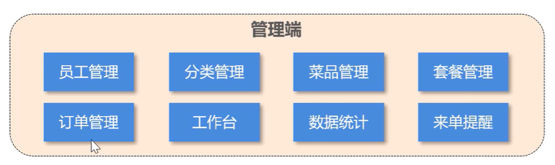
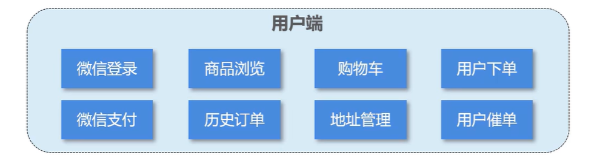
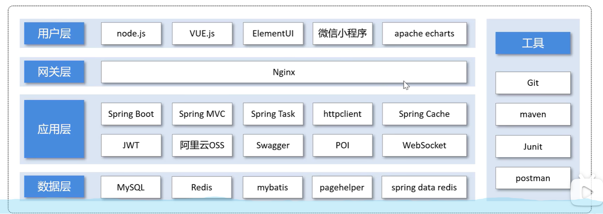
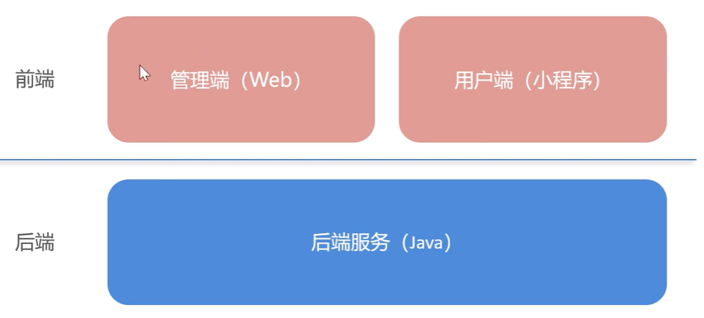

# 01-03 项目介绍

## 1. 功能架构

体现项目中的业务功能模块

### 管理端

### 用户端

## 2. 技术选型

展示项目中使用到的技术框架和中间件等

## 3. 整体结构

# 01-(04-11) 环境搭建

### 前端(管理端web)

1. 前端项目基于nginx运行，访问端口号为80

### 后端

基于maven进行项目构建，并且进行分模块开发

**sky-take-out**是父工程：统一管理依赖版本，聚合其他子模块

其下包括三个子工程，分别为：

#### 1. sky-common

存放公共类，例如：工具类，常量类，异常类等

#### 2. sky-pojo

*(Plain Old Java Object,普通旧java对象)*

存放实体类,VO,DTO等

#### 3. sky-serve

后端服务，存放配置文件，Controller，Service，Mapper等

#### 使用Git进行版本控制

